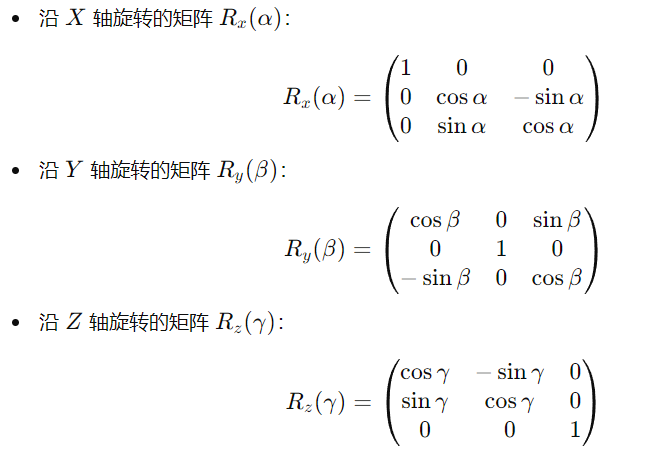
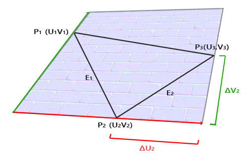
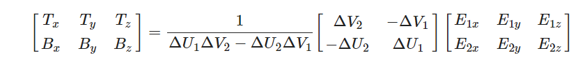
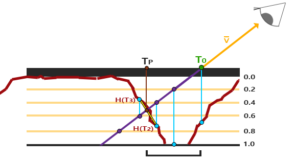

[TOC]

# 一、知识点

## 1.1	OpenGL相关

### 1.1.1	渲染测试的顺序

顶点着色器 => 面剔除 => 提前深度测试 => 片段着色器 => 模板测试 => 深度测试

- 使用**提前深度测试**时，片段着色器就不能写入片段的深度值
- **面剔除**：逆时针方向的三角形，视为正向三角形
  - 环绕顺序是在**光栅化**阶段进行的，此时顶点就是**观察者视角**所见的

### 1.1.2	坐标系

> 左手坐标系

观察点`(0,0,5)`，向上方向`(0,1,0)`，欧拉角`yaw=-90°, pitch=0`

- X轴：向右
- Y轴：向上
- Z轴：向屏幕外

### 1.1.3	将方向向量转化为沿XYZ轴旋转的角度

> 将`(1, 0, 0)`沿`X,Y,Z`轴分别旋转`α,β,γ`角度：

旋转矩阵：



将`(1, 0, 0)`沿`X,Y,Z`轴分别旋转`α,β,γ`角度：
$$
(x,y,z)^T=R_z(γ)·R_y(β)·R_x(α)·(1,0,0)^T
=>\\
\begin{aligned}
x&=\frac{\cos(β+γ)+\cos(β-γ)}{2} = \cos(β)\cos(γ) \\
y&=\frac{\sin(β+γ)-\sin(β-γ)}{2} = \cos(β)\sin(γ) \\
z&=\sin(β)
\end{aligned}
=>\\
\begin{aligned}
α&= 0 \\
β&= arcsin(z) \\
γ&= arctan(y/x)
\end{aligned}
$$

## 1.2	抗锯齿算法

### 1.1.1	SSAA：超采样抗锯齿

> Super Sample Anti-aliasing，以**4x**为例

- 每个像素有4个采样点，需要**运行4次片段着色器**渲染一个像素
  - 顶点数据插值到每个采样点的位置
- 像素的最终颜色：4次渲染结果的平均值

### 1.1.2	MSAA：多重采样抗锯齿

> Multisampling Anti-aliasing，以**4x**为例
>
> - 对每个像素来说，越少的采样点被三角形覆盖，那么它受到这一个三角形的影响就越小

- 每个像素有4个采样点，但**仅运行一次片段着色器**渲染一个像素
  - 顶点数据插值到像素中心
- 渲染结果将会保存在物体覆盖到的每个采样点上
- 像素最终的颜色：所有采样点颜色的平均值

## 1.3	sRGB颜色空间

- 基于**gamma2.2**的颜色空间叫做sRGB颜色空间
- 未经过任何变换的线性颜色空间，为**gamma1**

## 1.4	阴影贴图

### 1.4.1	解决阴影悬浮(Peter Panning)问题

- 渲染深度贴图时，使用**正面剔除**
- 但只对内部不会对外开口的实体物体有效

> 因为我们只需要深度贴图的深度值，对于实体物体无论我们用它们的正面还是背面都没问题。使用背面深度不会有错误，因为阴影在物体内部有错误我们也看不见


### 1.4.2	PCF 百分比渐进过滤

核心思想：在**深度贴图中多次采样**，每一次采样的纹理坐标都稍有不同
- 每个独立的样本可能在也可能不再阴影中
- 所有的采样结果接着结合在一起，进行平均化，我们就得到了柔和阴影

## 1.5	法线贴图

核心思想：通过贴图控制每一个像素的法线，从而更改与光线的交互

- TBN矩阵：法线贴图定义在局部坐标系的切线空间中，此时法线永远指向+z方向


### 1.5.1	手动计算切线、副切线



在上图中：
$$
\vec{E_1}=\Delta U_1 \vec{T}+ \Delta V_1 \vec{B} \\
\vec{E_2}=\Delta U_2 \vec{T}+ \Delta V_2 \vec{B} \\
$$
解方程得：



## 1.6	视差贴图


核心思想：通过贴图修改像素点的纹理坐标，使其表面看起来比实际的更高或者更低

- 通常情况下，视差贴图需要与法线贴图一起使用，因为需要保证光照与位移匹配

### 1.6.1	视差贴图原理


- $B$点：期望观察到的点
- $A$点：实际观察到的点
  - $H(A)$：A点采样深度贴图得到的深度值
- $\vec{V}$：观察方向
- $\vec{P}$：根据$H(A)$对$\vec{V}$进行缩放，得到向量$\vec{P}$
- $B$点的纹理坐标：$UV = (\vec{P}.x, \vec{P}.y)$

**在使用视差贴图时，要将坐标变换到切线空间中，此时$\vec{P}$的xy元素与切线和副切线向量对齐，得到的值即为纹理坐标**

### 1.6.2	深度贴图


视差贴图通常使用反色高度贴图，也叫**深度贴图**，模拟深度而非高度

- $\vec{P}$：根据$H(A)$对$\vec{V}$进行缩放，得到向量$\vec{P}$
- $B$点的纹理坐标：$UV = UV_A - (\vec{P}.x, \vec{P}.y)$

```glsl
vec2 ParallaxMapping(mat3 TBN) {
    vec3 view_dir_TBN = normalize(TBN * fs_in.ViewPosition - TBN * fs_in.Position); 
    float height = texture(material.depth, fs_in.TexCoord).r;
    vec2 p = view_dir_TBN.xy / view_dir_TBN.z * (height * material.height_scale);
    return fs_in.TexCoord - p;
}
```

### 1.6.3	陡峭视差映射：Steep Parallax Mapping


核心思想：将总深度范围划分为多个层，每个层沿$\vec{P}$的方向移动采样纹理坐标，直到找到一个采样低于当前层的深度值

```glsl
vec2 ParallaxMapping(mat3 TBN) {
    const vec3 view_dir_TBN = normalize(TBN * fs_in.ViewPosition - TBN * fs_in.Position); 
    const float min_layers = 10;
    const float max_layers = 20;
    const float num_layers = mix(max_layers, min_layers, abs(dot(vec3(0, 0, 1), view_dir_TBN)));
    const float delta_layer_depth = 1.0 / num_layers;

    /* 陡峭视差映射: 遍历每层, 采样深度值, 直到找到[层深>采样值]的层 */
    // 1. 计算层间UV坐标差值
    const vec2 P = view_dir_TBN.xy / view_dir_TBN.z * material.height_scale;
    const vec2 delta_tex_coord = P / num_layers;
    // 2. 获取当前层的初始值
    vec2 current_tex_coord = fs_in.TexCoord;
    float current_depth_map_value = texture(material.depth, current_tex_coord).r;
    float current_layer_depth = 0.0;
    // 3. 分层采样深度贴图
    while(current_layer_depth < current_depth_map_value) {
        current_tex_coord -= delta_tex_coord;
        current_depth_map_value = texture(material.depth, current_tex_coord).r;
        current_layer_depth += delta_layer_depth;
    }
    
    return current_tex_coord;
}
```

### 1.6.4	视差遮蔽映射：Parallax Occlusion Mapping



核心思想：与陡峭视差映射的原则相同，但不是用触碰的第一个深度层的纹理坐标，而是在触碰之前和之后，在深度层之间进行线性插值

```glsl
vec2 ParallaxMapping(mat3 TBN) {
    const vec3 view_dir_TBN = normalize(TBN * fs_in.ViewPosition - TBN * fs_in.Position); 
    const float min_layers = 10;
    const float max_layers = 20;
    const float num_layers = mix(max_layers, min_layers, abs(dot(vec3(0, 0, 1), view_dir_TBN)));
    const float delta_layer_depth = 1.0 / num_layers;

    /* 陡峭视差映射: 遍历每层, 采样深度值, 直到找到[层深>采样值]的层 */
    // 1. 计算层间UV坐标差值
    const vec2 P = view_dir_TBN.xy / view_dir_TBN.z * material.height_scale;
    const vec2 delta_tex_coord = P / num_layers;
    // 2. 获取当前层的初始值
    vec2 current_tex_coord = fs_in.TexCoord;
    float current_depth_map_value = texture(material.depth, current_tex_coord).r;
    float current_layer_depth = 0.0;
    // 3. 分层采样深度贴图
    while(current_layer_depth < current_depth_map_value) {
        current_tex_coord -= delta_tex_coord;
        current_depth_map_value = texture(material.depth, current_tex_coord).r;
        current_layer_depth += delta_layer_depth;
    }
    
    /* 视差遮蔽映射: 找到[层深>采样值]的层后, 对相邻两层进行插值 */
    // 1. 计算上一层的数据
    vec2 pre_tex_coord = current_tex_coord + delta_tex_coord;
    float pre_depth_map_value = texture(material.depth, pre_tex_coord).r;
    float pre_layer_depth = current_layer_depth - delta_layer_depth;
    // 2. 计算插值权重
    float current_delta_depth = current_depth_map_value - current_layer_depth;
    float pre_delta_depth = pre_depth_map_value - pre_layer_depth;
    float weight = current_delta_depth / (current_delta_depth - pre_delta_depth);
    // 3. 插值 pre_tex_coord 和 current_tex_coord
    vec2 final_tex_coord = pre_tex_coord * weight + current_tex_coord * (1.0 - weight);
    return final_tex_coord;
}
```

